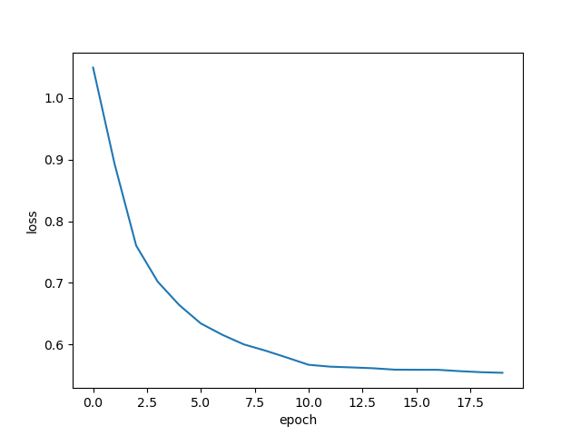

##1D-Convolutional neural network (1D-CNN) to differentiate DNA reads of different species

###Introduction

I was wondering whether a neural network would be capable of differentiating different species from Next-Generation-Sequencing (NGS) reads alone. Therefore, I performed the following experiment:

First, I decided for 3 different species, human, dolphin and bat. I then obtained NGS-reads from these species from the Sequence Read Archive [[1]](#references).
My choice fell on human, dolphin and bat.

Can a neural network differentiate between these species?

>Note: I will try to give some explanations of new concepts. If you are a beginner, and want to learn how neural networks work, you can check out my Vectorized_MLP_python repo. In that repo I give a detailed explanation of how artificial neural networks work by coding a vectorized MLP from scratch.

###Prepare the data

Now, let's obtain and prepare the samples:

The bat sample: [SRR18788643](https://www.ncbi.nlm.nih.gov/sra/?term=SRR18788643)

~~~bash
SRX14888052: DNAseq of Myotis brandtii Adult Male
1 ILLUMINA (Illumina HiSeq 4000) run: 93.8M spots, 26.4G bases, 10.9Gb downloads

Design: The sequencing and read trimming was conducted at the University of Liverpool Centre for Genomic Research. TruSeq Nano libraries with a 350 bp insert size were prepared from all samples and run on a HiSeq4000 platform to generate 2x 150 bp reads.
Submitted by: Finnish museum of Natural history
~~~

The dolphin sample [SRR25750764](https://www.ncbi.nlm.nih.gov/sra/?term=SRR25750764)

~~~bash
SRX21474192: Tursiops truncatus Whole genome sequencing with 10X linked reads
1 ILLUMINA (Illumina NovaSeq 6000) run: 240.8M spots, 72.7G bases, 22.9Gb downloads

Design: manufacturer's protocol
Submitted by: G10K
Study: Tursiops truncatus (bottlenose dolphin) genome, mTurTru1, sequence data
PRJNA1008618 • SRP456826 • All experiments • All runs
show Abstract
~~~

The human sample: [SRR9091899](https://www.ncbi.nlm.nih.gov/sra/?term=SRR9091899)

~~~bash
SRX5867019: WGS of Human NA12878
1 ILLUMINA (Illumina NovaSeq 6000) run: 524.6M spots, 154.6G bases, 68.7Gb downloads

Design: Sequenced using standard Nextera protocol
Submitted by: Rigshospitalet
Study: WGS sequencing of NA12878
~~~

After obtaining the fastq.gz (raw reads) files from the above links, we want to extract reads from each species that is similar in terms of both read length and quality.

Each read in a fastq file comes with quality metrics attached to it. 

If we are unlucky and obtain a higher percentage of low quality reads from one species, but a lower percentage in another species, our neural net may learn to differentiate the samples by recognizing features of low quality (perhaps low quality reads are more repetitive or have an enrichment in a specific nucleotide, etc).

Therefore, I wrote a little command line tool to extract reads with a specified average quality. More information on quality metrics can be found on Illuminas website ([Illumina](https://www.illumina.com/documents/products/technotes/technote_Q-Scores.pdf)) [[2]](#references).

By running the tool like this:

~~~bash
for file in */*_1.fastq.gz;
do
	python3 extract_reads.py -L 140 -Q 30 -F $file -R 100000 -O ${file%_1.fastq.gz}.txt
done
~~~

we obtain files with an average quality value of >30, a minimum length of 140 and containing 100000 reads.

I attached these files to this github repo with the names: 

SRR9091899.human.txt
SRR18788643.myotis.txt
SRR25750764.dolphin.txt

Let's look at a single read of each species:

~~~bash
1) 
TCACTGCCAGCATGTTGACGGTGTAGTCCTGCCAACACCTTGACTCCAGACCTCAGATCCCTAAAGCTGCAGGATAATAAATTTACGCTGTTTTAAGCCACCGACTTTGTGGTAGTTTGTTACAGAAGCAATGAGAAATTAATATGCAATA

2) 
CCCTAGGGCTCTACGGGGCCGGCATCTCCTGTCTCCTGGAGAGGCTTCGATGCCCCTCCACACCCTCTTGATCTTCCCTGTGATGTCATCTGGAGCCCTGCTGCTTGCGGTGGCCTATAAAGCCTCCTAGTCTGGCTCCAAGGCCTGGCAG

3) 
CTTCCTGATAACTGGTTTGTACTGCTGTTGACTGCATGATTCTATTTACTAAGATAGGGGAGAAACTATATAGTTTAGGAGCTTGAAGACATGCTGTATTTGAGATCCCTGAAGGACATCCAAGGAAAACGAGTTGTATATACACATCTT
~~~

Can you tell me which of those reads is from which species? Very hard actually... it is of course impossible for the human eye to differentiate a species by merely looking at its DNA sequence without computational tools (solution at the [end](#solution)).

However, there is a lot of structure in DNA, therefore I am really interested in how much we can find out with a neural net.

First, let's load python and pytorch modules we need:

~~~python
import numpy as np
import torch
import torch.nn as nn
import torch.optim as optim
from torch.utils.data import DataLoader, TensorDataset
from torch.optim import lr_scheduler
import torch.nn.functional as F
~~~

Now, let's load the files that we prepared:

~~~python
dolphin_reads = open("SRR25750764.dolphin.txt", "r").read().splitlines()
human_reads = open("SRR9091899.human.txt", "r").read().splitlines()
bat_reads = open("SRR18788643.myotis.txt", "r").read().splitlines()
~~~

If you look into the first lines of each file, you may notice, that the first couple of dolphin reads start with an N. Although, later reads are ok, finding this in raw reads, might be an effect of the sequencing chemistry.
If only one sample has been processed by a sequencer who generates ambiguous calls at the start, our net might converge on recognizing the sample by the presence of the N's. With the same logic in mind, also length might bias the network.

Therefore, I will trim the reads a little bit, to make it a uniform pool of sequences. 
More specifically, we will first determine the maximum and minimum length of the reads, and then trim them from the second nucleotide (to avoid starting N's) to min_length-2. This should work on all samples.

~~~python
max_seq_len = max([len(seq) for seq in dolphin_reads]+[len(seq) for seq in human_reads]+[len(seq) for seq in bat_reads])
min_seq_len = min([len(seq) for seq in dolphin_reads]+[len(seq) for seq in human_reads]+[len(seq) for seq in bat_reads])
     
dolphin_reads = [s[2:min_seq_len-2] for s in dolphin_reads]
human_reads = [s[2:min_seq_len-2] for s in human_reads]
bat_reads = [s[2:min_seq_len-2] for s in bat_reads]
~~~

To be sure, let's shortly check, whether we really only end up with DNA sequences of the same size:

~~~python
print(set([len(seq) for seq in dolphin_reads]))
print(set([len(seq) for seq in human_reads]))
print(set([len(seq) for seq in bat_reads]))
~~~

~~~bash
{136}
{136}
{136}
~~~

Very good. The output above shows indicates a length of 136 for all species.

Next, we need to convert the reads into the one-hot encoded format that will be well-suited to fit into our 1D convolutions:

~~~python
encoder = {"A" : 0, "T" : 1, "C" : 2, "G" : 3 }
decoder = {v:k for k,v in encoder.items()}

print("start one-hot encoding...")
def one_hot_encode(seq, nt_to_idx):    
    seq = np.array([nt_to_idx[c] for c in seq])
    one_hot = np.zeros((seq.size, 4))
    one_hot[np.arange(seq.size), seq] = 1        
    return torch.tensor(one_hot, dtype=torch.float32)
    
sequences_encoded_dolphin = [one_hot_encode(seq, encoder) for seq in dolphin_reads if 'N' not in seq]
sequences_encoded_human = [one_hot_encode(seq, encoder) for seq in human_reads if 'N' not in seq]
sequences_encoded_bat = [one_hot_encode(seq, encoder) for seq in bat_reads if 'N' not in seq]
~~~

As a tiny fraction of reads still has some N's somewhere in the read, and we decided to only encode A,T,C,G in our one-hot vector, we simply remove those reads.

Let's look at the first dolphin read:

~~~bash
TGTGGTCCCATTATCTCTGTAAGGAGAAAAAGTTGCTTGTAATCAATAATTTATAGTTCAAACATTGTTATAGTTGAAGACAAGCAACTTTTTCTCCCTAACCTCTTTCTCTCTTGTCACCCAAGAGACAGAGATA
~~~

and the corresponding one-hot encoding (A,T,C,G indicated):

~~~bash
         A   T   C   G
tensor([[0., 1., 0., 0.],
        [0., 0., 0., 1.],
        [0., 1., 0., 0.],
        [0., 0., 0., 1.],
        
        ...

        [0., 0., 0., 1.],
        [1., 0., 0., 0.],
        [0., 1., 0., 0.],
        [1., 0., 0., 0.]])
~~~

Now, we need to split our data into train and test set.
As we have plenty of reads, let's go for a 80:20 split:

~~~python
train_dolphin_num = int(np.floor(len(sequences_encoded_dolphin) * 0.8))
test_dolphin_num = len(sequences_encoded_dolphin) - train_dolphin_num

train_human_num = int(np.floor(len(sequences_encoded_human) * 0.8))
test_human_num = len(sequences_encoded_human) - train_human_num

train_bat_num = int(np.floor(len(sequences_encoded_bat) * 0.8))
test_bat_num = len(sequences_encoded_bat) - train_bat_num
~~~

To actually perform the split, we can use the numbers obtained above in a couple of slicing operations:

~~~python
sequences_encoded_dolphin_train = sequences_encoded_dolphin[:train_dolphin_num] 
sequences_encoded_human_train = sequences_encoded_human[:train_human_num]
sequences_encoded_bat_train = sequences_encoded_bat[:train_bat_num]

sequences_encoded_train = sequences_encoded_bat_train + sequences_encoded_dolphin_train + sequences_encoded_human_train 
sequences_padded_train = nn.utils.rnn.pad_sequence(sequences_encoded_train, batch_first=True)
~~~

Note: We utilized "nn.utils.rnn.pad_sequence(sequences_encoded_train, batch_first=True)", which is typically padding all sequences with zeros to the maximum length. The reason for that is, that I initially aimed at utilizing all reads, resulting in reads with different length. However, I realized that the network could learn from the varying lengths instead of the actual sequence of nucleotides. If the sequencer that sequenced human DNA mostly obtains 140 bp and the sequencer that sequenced bat DNA usually obtains 130 bp, the network does not need to learn anything except the difference in length. Importantly, the nn.utils.rnn.pad_sequence() will also convert the list of tensors to one big tensor. If you know that all tensors are of the same size, you can also just utilize torch.stack(). This will also convert a list of tensors into one large tensor.

Due to the fact, that we concatenate the sequences, before converting them into one large tensor, we can very easily generate a corresponding tensor for the labels.
I also generate a label_dict, to keep track which number corresponds to which label:
~~~python
label_dict = {2 : "bat", 1 : "dolphin", 0 : "human"}
labels_train = [2]*len(sequences_encoded_bat_train) + [1]*len(sequences_encoded_dolphin_train) + [0]*len(sequences_encoded_human_train)
labels_tensor_train = torch.tensor(labels_train, dtype=torch.long)
~~~

The same procedure is done for the test set (not shown).

Finally, we package sequence and label tensors into pytorchs TensorDataset. Here, we decided for minibatches of size 256.
The shuffle=True ensures that the sequences within the minibatches are getting mixed for each epoch. 

~~~python
dataset_train = TensorDataset(sequences_padded_train, labels_tensor_train)
dataset_test = TensorDataset(sequences_padded_test, labels_tensor_test)
    
dataloader_train = DataLoader(dataset_train, batch_size=256, shuffle=True)
dataloader_test = DataLoader(dataset_test, batch_size=256, shuffle=True)
~~~

###Creating a 1D-Convolutional neural net (1D-CNN)

Whereas I was only briefly looking at a vanilla LSTM, I tuned a little more with the 1D-CNN. Therefore, I will focus on that architecture here. The model is pretty straightforward.
The one-hot encoded reads are fed into the 1D-CNN with three 1D convolutions.

For further information, PyTorch has an excellent documentation [[3]](#references).

The kernel size we used here is 5, although I also tested larger kernels, in hope to preserve some more distant informations, but going beyond kernel size of 5 did not improve the network.

Each 1D convolution is followed by a ReLU non-linearity and a MaxPool1d layer.

Finally, we flatten the filters (while preserving the batches) and feed it into several fully connected layers, each followed by a dropout layer, to prevent overfitting.

With a kernel size of 5 and a subsequent MaxPool1d we end up with the following reduction in dimensions, when forward propagating through the 1D convolutions and MaxPool layers.

~~~bash
torch.Size([256, 4, 136])
torch.Size([256, 32, 67])
torch.Size([256, 64, 32])
torch.Size([256, 128, 15])
~~~

The stride is always kept to 1, because in DNA sequences, each subset of nucleotides can potentially encode important meaning, e.g. CpG island, transcription factor-binding motifs, etc. 

The full model can be inspected in the following lines of code.
Feel free to experiment with it:

~~~python
class DNA_CNN3(nn.Module):
    def __init__(self, max_length=150):
        super(DNA_CNN3, self).__init__()
        self.max_length = max_length
        
        self.conv1 = nn.Conv1d(in_channels=4, out_channels=32, kernel_size=5, stride=1, padding=1)        
        self.conv2 = nn.Conv1d(in_channels=32, out_channels=64, kernel_size=5, stride=1, padding=1)
        self.conv3 = nn.Conv1d(in_channels=64, out_channels=128, kernel_size=5, stride=1, padding=1)
        self.pool = nn.MaxPool1d(kernel_size=2, stride=2)
        self.fc1 = nn.Linear(128 * 15, 128)
        self.fc2 = nn.Linear(128, 64)
        self.fc3 = nn.Linear(64, 32)
        self.fc4 = nn.Linear(32, 3)

        self.dropout = nn.Dropout(0.5)

    def forward(self, x):        
        x = self.pool(nn.functional.relu(self.conv1(x)))                                
        x = self.pool(nn.functional.relu(self.conv2(x)))                                
        x = self.pool(nn.functional.relu(self.conv3(x)))            
        x = x.view(-1, 128 * 15)                                                
        x = self.dropout(nn.functional.relu(self.fc1(x)))                        
        x = self.dropout(nn.functional.relu(self.fc2(x)))            
        x = self.dropout(nn.functional.relu(self.fc3(x)))            
        x = self.fc4(x)        
        return x
~~~

We then declare the model and shift it to our GPU (NVIDIA RTX 3060 in my case).

~~~python
model = DNA_CNN3(max_length=max_sequence_length).cuda()
~~~

We then declare our loss function, optimizer and step_scheduler:

~~~python
criterion = nn.CrossEntropyLoss()

optimizer = optim.Adam(model.parameters(), lr=1e-4, weight_decay=1e-5) 
    
step_scheduler = lr_scheduler.StepLR(optimizer, step_size = 10, gamma=0.1) 
~~~

The CrossEntropyLoss is the obvious choice of loss function/criterion for a multiclass prediction problem (note: nn.CrossEntropyLoss() expects pre-softmax input, therefore there is no need to feed the fully connected layer output of the last layers (the logits) into a softmax function, instead the softmax step will be done by nn.CrossEntropyLoss().

For the optimizer I empirically tried learning rates of 1e-2 to 1e-5, but 1e-4 turned out to be the best choice.

The weight_decay of 1e-5 serves as an L2 regularization to prevent overfitting [[4]](#references).

Intuitively, I find the the idea of learning rate decay very convincing. At the beginning the learning rate is set to 1e-4 in our example, but each 10 epochs, we decrease the learning rate by a factor of 10 (multiply it by a gamma of 0.1). 
Whereas the larger learning rate (gradient descent takes bigger steps) helps the network converge faster at the start, the smaller steps prevent it from overshooting the local minima or saddle points at the end of the training.
To me, this feels like an efficient way to navigate the error surface and a plausible way to increase convergence efficiency.

###Starting the training

First, let's include the following line, to make use of the .to(device) function later. This makes it easy to shift tensors to the GPU.

~~~python
device = "cuda" if torch.cuda.is_available() else "cpu"
~~~

Then let's start with the training:

~~~python
num_epochs = 20
losses = []    

for epoch in range(num_epochs):
    model.train()
    loss_sum = 0
    count = 0        
    for inputs, labels in dataloader:
        
        inputs = inputs.permute(0,2,1)
        
        inputs, labels = inputs.to(device), labels.to(device)                        
        optimizer.zero_grad()
        outputs = model(inputs)
        loss = criterion(outputs, labels)           
        loss_sum += loss            
        count += 1            
        loss.backward()            
        
        optimizer.step()
                        
    avg_loss = loss_sum/count        
    losses.append(avg_loss)        
    step_scheduler.step()
    
    print(f'Epoch {epoch}/{num_epochs}, Loss: {avg_loss}')
~~~

We also include a train accuracy check every 10 epochs:

~~~python
if epoch % 10 == 0:    
    model.eval()
    total_num = 0
    total_correct = 0
    with torch.no_grad():
        for inputs, labels in dataloader:            
            inputs = inputs.permute(0,2,1)            
            inputs, labels = inputs.to(device), labels.to(device)            
            pred = model(inputs)                     

            predicted_labels = np.argmax(pred.detach().cpu().numpy(), axis=1)
            labels = labels.cpu().numpy()
            correct = np.sum(labels == predicted_labels)                
            num = len(predicted_labels)
            total_num += num
            total_correct += correct                    
    print(f"train accuracy at epoch {epoch}: total_correct={total_correct}, total_num={total_num} {total_correct/total_num}")
~~~

###Running the 1D-CNN

If everything works as expected, you should see the network train:

~~~python
start training
Epoch 0/20, Loss: 1.0401767492294312
train accuracy after epoch 0: total_correct=135432, total_num=239977 accuracy=0.5643540839330435
Epoch 1/20, Loss: 0.8729633092880249
Epoch 2/20, Loss: 0.7405604124069214
Epoch 3/20, Loss: 0.6870680451393127
...
~~~

It will also save a plot of the loss:

The model weights can be saved by the following line:
~~~python
torch.save(model.state_dict(), 'model_weights.pt')
~~~

Finally, we can also check how our model performs on the test set:

~~~bash
test accuracy after 20 epochs of training:
total_correct=48919, 
total_num=59996,
accuracy=0.8153710247349824
~~~

<b>81.5 %</b> accuracy is the performance of our model in differentiating reads from human, dolphin and bat DNA. This is great and much better then guessing, which would result in an accuracy of 33.3 %.
However, I was hoping to differentiate even better between those three species.
I actually tried quite a lot of different architectures, including many variations of the above model. Some models had much more parameters and took significantly longer to train, but it turned out to be pretty hard to go >0.8 accuracy. Even increasing the amount of training data by a factor of 10, did only yield an improvement of ~ 1-2 %.

Also an LSTM that I trained, was not able to go beyond 80 %.
Maybe we need to go for a transformer architecture in the future.

###Summary

We successfully trained a 1D-convolutional neural network to differentiate 3 species by looking at reads of DNA.

We got to an accuracy of 81.5 % which is already quite impressive, given that we are learning with a context window of only 136 nucleotides.

###References

<a id="1">[1]<a/> https://www.ncbi.nlm.nih.gov/sra
<a id="2">[2]<a/> https://www.illumina.com/documents/products/technotes/technote_Q-Scores.pdf
<a id="3">[3]<a/> https://pytorch.org/docs/stable/generated/torch.nn.Conv1d.html
<a id="4">[4]<a/> https://pytorch.org/docs/stable/generated/torch.optim.Adam.html

###Solution

~~~bash
1) dolphin
TCACTGCCAGCATGTTGACGGTGTAGTCCTGCCAACACCTTGACTCCAGACCTCAGATCCCTAAAGCTGCAGGATAATAAATTTACGCTGTTTTAAGCCACCGACTTTGTGGTAGTTTGTTACAGAAGCAATGAGAAATTAATATGCAATA

2) human
CCCTAGGGCTCTACGGGGCCGGCATCTCCTGTCTCCTGGAGAGGCTTCGATGCCCCTCCACACCCTCTTGATCTTCCCTGTGATGTCATCTGGAGCCCTGCTGCTTGCGGTGGCCTATAAAGCCTCCTAGTCTGGCTCCAAGGCCTGGCAG

3) bat
CTTCCTGATAACTGGTTTGTACTGCTGTTGACTGCATGATTCTATTTACTAAGATAGGGGAGAAACTATATAGTTTAGGAGCTTGAAGACATGCTGTATTTGAGATCCCTGAAGGACATCCAAGGAAAACGAGTTGTATATACACATCTT
~~~

